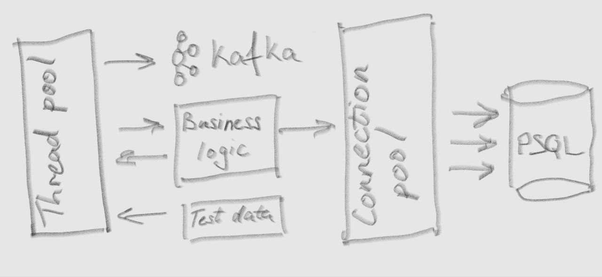
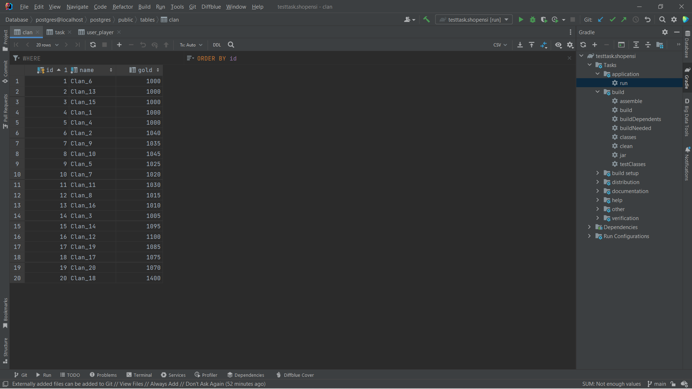
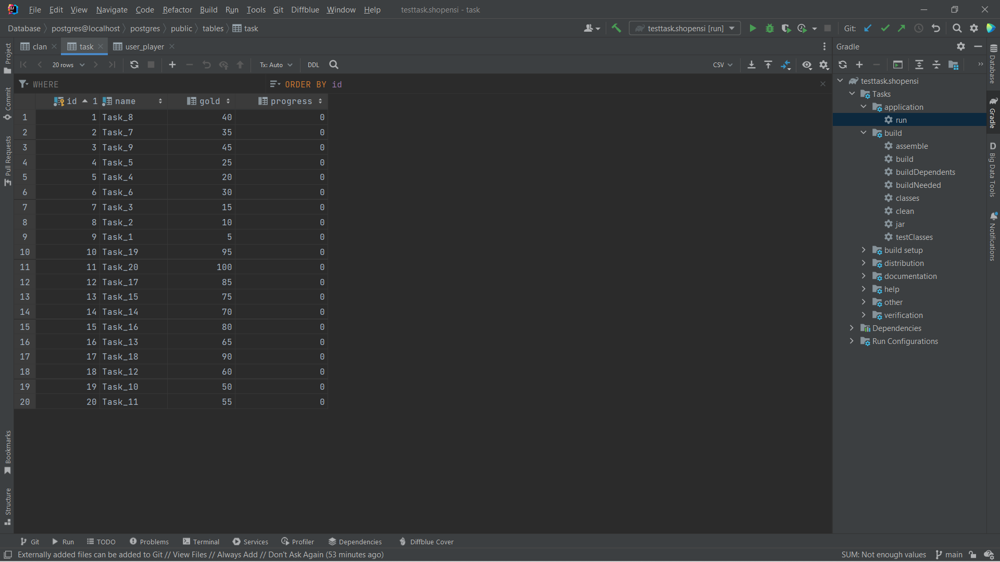
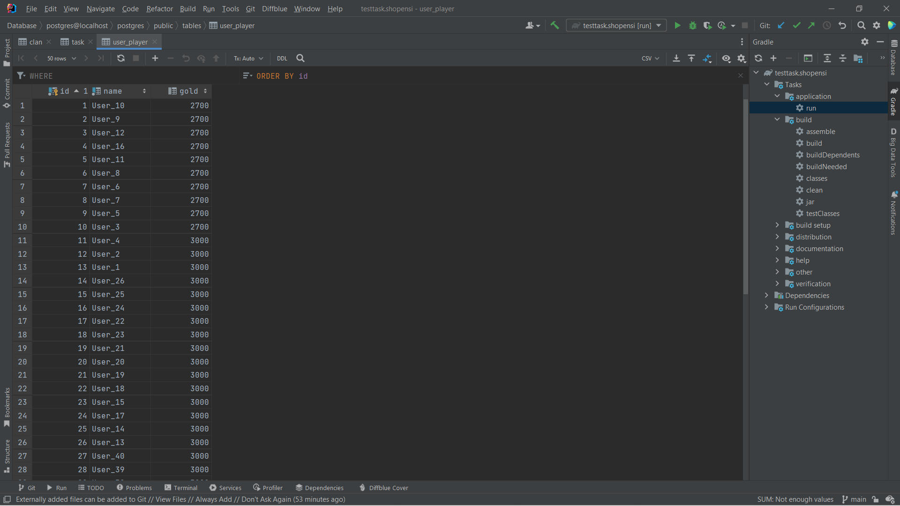

<h2>Тестовое задание для Java разработчика</h2>

<h3>Преамбула</h3>
В игре есть такая механика как кланы, иначе говоря скопления игроков объединенные общей целью. У каждого клана есть своя казна с золотом. Есть различные способы пополнения казны клана. Можно выполнять задания, сражаться на арене, просто пополнить казну из своего кармана и т.д. И конечно же мы следим за всеми действиями, чтобы в случае чего служба поддержки могла как-то отвечать на вопросы пользователей в случае какого-то недопонимания. 

<h3>Задачи</h3>
1. Реализовать логику добавления/уменьшения золота в клан, при этом предусмотреть, что золото может зачислиться из сотни(100) разных потоков в один момент. Разными пользователями по разной причине. 
2. Реализовать отслеживание разных действий начисления золота, чтобы служба поддержки смогла идентифицировать когда и по какой причине в казне изменилось количества золота, сколько было, сколько стало и т.д. 

<h3>Ограничения</h3>
Задание нацелено на демонстрацию знаний java, в частности знание многопоточности.
Не стоит использовать высокоуровневые библиотеки такие как Spring, Hibernate. При необходимости лучше использовать что-то на уровне JDBC.

<h2>Реализация</h2>
В основу приложения положена следующая архитектура: 

img.1 

 
Приложение содержит генератор тестовых данных для демонстрации своей работы. Тестовые данные обрабатываются приложением в многопоточном режиме и результат записывается в PostgreSQL. 
Метрики мониторинга действий по добавлению/уменьшению золота сохраняются в Kafka. В случае недоступности Kafka, метрики сохраняются в резервной системе хранения. Для демонстрации идеи в качестве резервной системы хранения реализовано сохранение в ConcurrentLinkedQueue<>. В случае восстановления Kafka, ранее направленные и новые метрики мониторинга событий записываются в Kafka. 
Код частично покрыт Unit-тестами (100% - логики добавления/уменьшения золота в клан, 42% - всего приложения). В тестах в качестве БД используется H2, для мониторинга - реализация мониторинга в памяти. 

<h3>Запуск приложения</h3>
Перед запуском приложения (gradle run) необходимо поднять docker-образы PostgteSQL и Kafka из файла docker-compose.yml в корне проекта. 

Работа с тестовыми данными занимает менее 2 минут. 
После заверщения генерации тестовых данных можно наблюдать следующую картину в таблицах БД.
 
 
img.2(clan): <i>все цифры остатков кратны 5, что подтверждает отсутствие потери данных, т.к. сумма всех добавлений/уменьшений золота клана генератором тестовых данных кратна 5</i>

 
 
img.3(task): <i>прогресс всех заданий равен 0, что свидетельствует об исполнении заданий и зачислении вознаграждения в пользу клана</i>

 
 
img.4(user_player): <i>все цифры остатков кратны 100, что подтверждает отсутствие потери данных, т.к. сумма всех добавлений/уменьшений золота игрока генератором тестовых данных кратна 100</i>

 
 
в Kafka:
 
img.5: <i>пример метрики мониторинга события</i>

 

<h3>Что не было сделано, но обязательно в работе</h3>
1. Покрытие unit tests (до 95% всего кода) 
2. JavaDoc. 
